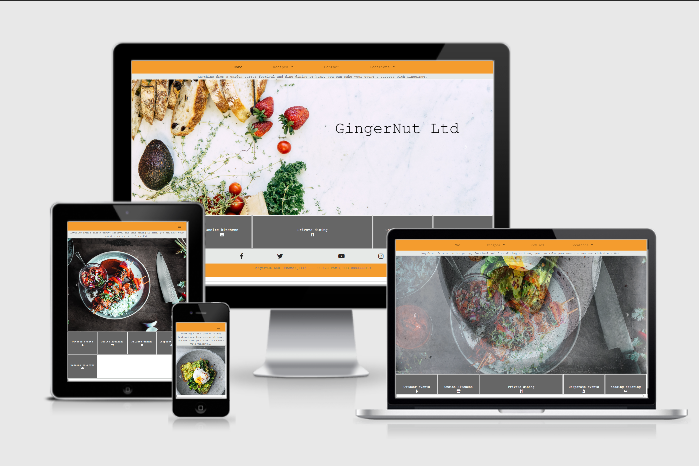

# Catering & Events by Peter Freemantle

## Deployed version

https://sdmusic.github.io/Mk1-Project/.

This site will be an ongoing page, designed with javascript elements in  mind for implementation.

Initial creation is for my First milestone project on the Code Institute (https://codeinstitute.net/) Full Stack Developer course, with the goal of representing my html and css skills inline with showing my experience in other sectors and previous experience.

## UX

For who this website is created
This Webiste was created for the former Event catering group “GingerNut Catering Ltd”

### At who this website is targeted

This website is targeted at high disposable income individuals and companies  in.between their 30’s and 70’s in the united kingdom, looking for private catering.
Which language is used and why
Though the united kingdom is a multicultural country, the website has been put in English as it is the predominate language.

### What is the goal to achieve with this website

The goal is to provide a concise platform offering information on the services available and provide a marketing platform with contact links are available for information requests and bookings.

### User stories

As a potential event organiser  who has a rough idea of what im looking for I would want to be able to find out where I can sample the offering be able to contact the services provider to ask about the request that I have.
I would also be looking to see images of what was on offer and to keep up to date with any upcoming events I could attend.
It needs to be straight forward so I do not feel out of my depth and be able to see if they have the services I am looking for that would be identifiable after entering the website off a google search.
As a user who already bought the record I want to be able to stream or download the music and listen to it everywhere I want. I'll also want to see the video of the releaseparty and be notified of any future projects.

## Concept

This will be a multiple pages website, home page will be an image carousel showing  the service, product and branded images. A banner with download links underneath with fixed header containing a text banner and navigation bar. Footer will be fixed at the bottom of the page with contact phone numbers and social network links.
The header will keep the banner in both desktop and mobile. In desktop the links will keep across full screen but move to a burger icon when in mobile allowing for the content to be kept clear and visible.
The navigation menu will contain dropdown link allowing for expansion of pages by leading to some of the page pages broken down by id tags. The nav menu will have active screens set allowing the user to know where they are in the site.

The site will be fully responsive and optimized to be viewed on different screen sizes and devices.

## WireFrames

The original wireframe concept  is available <a href= "assets/wireframes/Mk1 Project - peter freemantle.pdf" target="_blank">Here</a> and in assets/wireframes/Mk1 Project - peter freemantle.pdf

## Basic features

* Multiple pages with nav bar to the different pages and sections.
* Sticky top menu, for  easy naviagtion.
* Footer and download Menu with icons for an intuitive design with an alternative for visual impaired people.
* Icons screen.
* Mouse-hover tooltips for icons and links.
* Custom scroll bar for scrolling for recipe page items.
* Carousel on homepage to catch the eye.
* Fully responsive design.
* Burger icon with drop down for smaller screens
* Youtube and google maps embedded in locations page for directions and examples of what is to be seen at the locations.
* Download section for the sample menus.
* Cover-art section to showcase the album-art.
* Footer with credits and links to contributers to both the website as the record.
* Form to contact for further information and requests.
* In this release the form will do nothing but reload the page, as its functionality is out of the scope of this project.
* Optional Features to be implemented later

## Technologies Used

HTML, or Hyper Text Markup Language: Used to construct all the pages of this web site. For further info on this language;
https://developer.mozilla.org/en-US/docs/Web/HTML

CSS, or Cascading Style Sheets: Is used to style various elements on a web page via coloring, fonts, spacing, etc. For further info, see this link; https://www.w3.org/Style/CSS/Overview.en.html

Bootstrap: Bootstrap is a potent front-end framework used to create modern websites and web apps. It's open-source and free to use, yet features numerous HTML and CSS templates for UI interface elements such as buttons and forms. Bootstrap also supports JavaScript extensions. https://getbootstrap.com/

Gitpod: An online IDE which streamlines developer workflows by providing prebuilt, collaborative development environments in your browser - powered by VS Code. it does not have to be installed on your PC. https://www.gitpod.io/

GitHub: a code hosting platform for version control and collaboration. It lets you and others work together on projects from anywhere. ... You'll create your own Hello World repository and learn GitHub's Pull Request workflow, a popular way to create and review code. https://github.

Chrome DevTools: Web developer tools built directly into the Google Chrome browser. I used these tools at every step to test the functionality of my code. https://developers.google.com/web/tools/chrome-devtools

W3C Markup Validation Service Used to run all html and css code through a validation to identif if the code meets current standards and wether or not it is showing errors. https://validator.w3.org/ https://jigsaw.w3.org/css-validator/validator

Git: A version control system for tracking changes in source code during software development. https://git-scm.com/

## Testing

I used http://ami.responsivedesign.is/ (source for top picture) to see how the site displays on ranging devices and their viewports, all pages, links, icons performed as expected on all devices.

I also used a small pool of 15people fitting the target demographic for design testing.

## Content
Technology Software descriptions sourced from google.

Fontawesome for icon styling; https://https://fontawesome.com/

Google Fonts for font styles; https://fonts.google.com/

favicon icon created at; https://https://www.ionos.co.uk/tools/favicon-generator

## Media

Google Images using license free search tool, for carousell images; https://google.com/imghp?hl=EN

Am I Responsive web site for checking responsiveness on different platforms and for image at top of page; http://ami.responsivedesign.is/

Code example resource; https://stackoverflow.com/ 

## Acknowledgements

My mentor Adegbenga Adeye for his guidance over the course of this project, with aesthetic decisions and advice. 

## Errors & Upcoming Updates:

-hide id left in place for java script update.
-video player to open in a smaller middle screen when clicked to be applied using javascript
