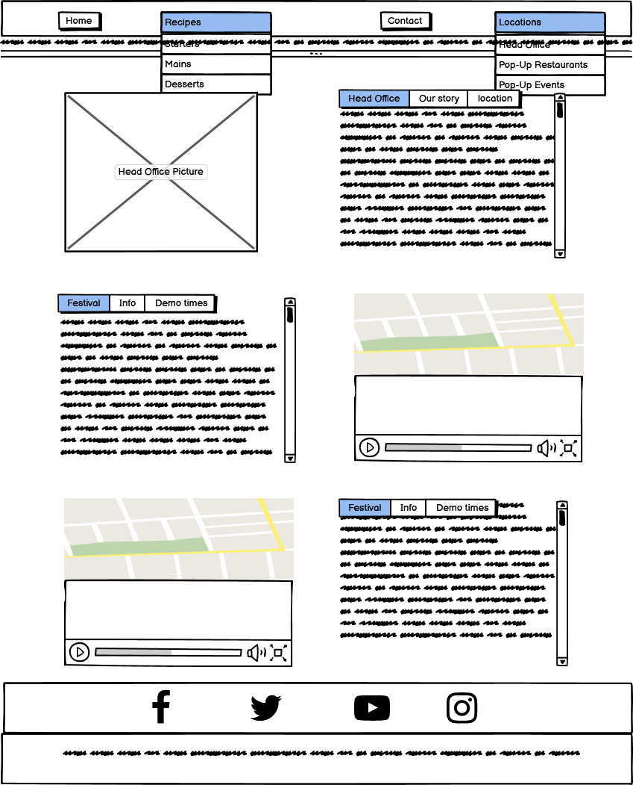

<!DOCTYPE HTML PUBLIC "-//W3C//DTD HTML 4.0 Transitional//EN">

<html>
<head>
</head>

<body>

# GingerNut Catering & Events by Peter Freemantle

## Deployed version

https://sdmusic.github.io/Mk1-Project/.

This site will be an ongoing page, designed with javascript elements in  mind for implementation.

# **Contents**
[**1 UX**](#1-ux)
- [1.1 What is the Site About?](#1.1-what-is-the-site-about)
- [1.2 What is the Purpose of the Site?](#1.2-what-is-the-purpose-of-the-site)
- [1.3 Who Built the Site and Why?](#1.3-who-built-the-site-and-why)
- [1.4 Concept](#1.4-concept)
- [1.5 User Stories](#1.5-user-stories)

[**2 Site Content, Structure Concept and Development**](#2-site-content-structure-concept-and-development)
- [2.1 Pages Overview](#2.1-pages-overview)
- [2.2 Global Elements](#2.2-global-elements)
    - [2.2.1 Page Responsiveness](#2.2.1-page-responsiveness)
    - [2.2.2 Colours](#2.2.2-colours)
    - [2.2.3 Fonts](#2.2.3-fonts)
    - [2.2.4 Page Layout](#2.2.4-page-layout)
    - [2.2.5 Page Header](#2.2.5-page-header)
    - [2.2.6 Features](#2.2.6-features)
    - [2.2.7 Page Footer](#2.2.7-page-footer)
- [2.3 - Individual Pages](#2.3-individual-pages)
    - [2.3.1 Home Page](#2.3.1-home-page)
    - [2.3.2 Starters](#2.3.2-starters)
    - [2.3.3 Mains](#2.3.3-mains)
    - [2.3.4 Desserts](#2.3.4-desserts)
    - [2.3.5 Location](#2.3.5-location)
    - [2.3.6 Contact](#2.3.6-contact)
    - [2.3.7 Photo Gallery](#2.3.7-photo-gallery)

[**3 Technologies Used**](#3-technologies-used)
- [3.1 HTML or Hyper Text Markup Language](#3.1-html-or-hyper-text-markup-language)
- [3.2 CSS or Cascading Style Sheets](#3.2-css-or-cascading-style-sheets)
- [3.3 Bootstrap](#3.3-bootstrap)
- [3.4 Chrome DevTools](#3.4-chrome-devtools)
- [3.5 Font Awesome](#3.5-font-awesome)
- [3.6 Google Fonts](#3.6-google-fonts)
- [3.7 Gitpod](#3.7-gitpod)
- [3.8 GitHub Repository](#3.8-github-repository)
- [3.9 W3C Markup Validation Service](#3.9-w3c-markup-validation-service)
- [4.0 Screenshot - Full Page Screen Capture](#4.0-screenshot-full-page-screen-capture)

[**4 Testing**](#4-testing)
- [4.1 Page Layouts](#4.1-page-layouts)
- [4.2 Test: Header](#4.2-test-header)
    - [4.2.1 Navbar Navigation](#4.2.1-navbar-navigation)
- [4.3 Test: Footer](#4.3-test:-footer)
- [4.4 Home Page](#4.4-home-page)
- [4.5 Starters Page](#4.5-starters-page)
- [4.6 Mains Page](#4.6-mains-page)
- [4.7 Desserts Page](#4.7-desserts-page)
- [4.8 Mains Page](#4.8-mains-page)
- [4.9 Contact Page](#4.9-contact-page)
- [4.10 Errors and fixs](#4.10-errors-and-fixs)

[**5 Source Code**](#5-source-code)

[**6 Deployment**](#6-deployment)

[**7 Credits and Acknowledgements**](#7-credits-and-acknowledgements)

-------------------------------

# **1 UX**

## **1.1 What is the Site About**
'Ginger Nut Catering' is a private catering company based in Shropshire.
The site is intended to offer information on a range of different catering services, 
from garden parties to wedding and events catering and can operate nationwide. 
There is a variety of preselected menus to choose from as well as being able to discuss 
themes and tastes to build the perfect event catering experience.

The site offers the additional incentive to revisit with the recipe pages available.

Discussion is available to anyone interested in putting on an event through the message feature.
There are regular open events that the site user is invited to attend through the locations page.

## **1.2 What is the Purpose of the Site**
The site has a practical and a theoretical purpose:

### **Practical**
The practical purpose of this site is to showcase my abilities as a developer and 
to put into practice the knowledge I have acquired over the period of my course.
 This site concept of this practical application is to create a predominantly CSS and html focus,
  With a view to allow further development. As such, the site is constructed with Bootstrap 
as a partial base with custom CSS overlaying to show an understanding of both elements.

### **Theoretical**

1. The goal is to provide a concise platform offering information on the services available and
 provide a marketing platform with contact links are available for information requests and bookings.

2. **New Clients**: The site is intended to provide a marketing platform,
providing access to information on the services provided and imagery of
the products available. The site is built on the premise that potential clients
will already have an event in mind when coming to the site and showcasing a variety 
of events could keep 'GingerNut Catering' in mind for smaller or bigger events.
As well as providing recipes and locations of open popup events which a potential client 
can further investigate the product they are looking for. The contact page provides them 
with a non commital process to start their enquiry

3. **Existing Clients**: Existing Clients will be able to keep up to date with new popup events
where they can join us, Keep up to date with seasonal menus and free recipes. The contact
page provides the same benefits to a existing client as it does to new clients.

## **1.3 Who Built the Site and Why**
This site was conceived, designed and built by Peter Freemantle for his first "User Centric 
Frontend Development Milestone Project",  as part of his Full-Stack Developer Diploma 
course from [Code Institute](https://codeinstitute.net/), through Edinburgh Napier University. He has been a part of the hospitality
industry and a chef from 2008-2020.

## **1.4 Concept**

This will be a multiple pages website, the home page will be an image carousel showing  the service, 
product and branded images. A banner with download links underneath with fixed header containing a text banner and navigation bar. 
The Footer will be fixed at the bottom of the page with contact phone numbers and social network links.
The header will keep the banner in both desktop and mobile. In desktop the links will keep across full screen, 
but move to a burger icon when in mobile, allowing for the content to be kept clear and visible.
The navigation menu will contain dropdown link allowing for expansion of pages by leading to some of the page pages broken down by id tags.
 The new menu will have active screens set, allowing the user to know where they are on the site.

The site will be fully responsive and optimized to be viewed on different screen sizes and devices.

## **1.5 User Stories**

As a potential event organiser  who has a rough idea of what I'm looking for I would want to be able to find out where
 I can sample the offering be able to contact the service provider to ask about the request that I have.
I would also be looking to see images of what was on offer and to keep up to date with any upcoming events I could attend.
It needs to be straight forward so I do not feel out of my depth and be able to see if they have the services I am looking for that would be identifiable after entering the website from a google search.

[**Back to top of Introduction**](#introduction)

[⬆ Back to Contents](#contents)

......................

# **2 Site Content, Structure Concept and Development**

## **2.1 Pages Overview**
The website consists of six pages, accessable through the navigation bar at the top of each page.
1. **[Home Page](#2.3.1-home-page)**: A picture carousel sample menu links and desciption banner.
2. **[Starters](#2.3.2-starters)**: One of three from the recipe dropdown currently offering the recipe for 1 of 'GingerNut Catering'
 signiture dishes. 
3. **[Mains](#2.3.3-mains)**: One of three from the recipe dropdown currently offering the recipe for 1 of 'GingerNut Catering'
 signiture dishes.
4. **[Desserts](#2.3.4-desserts)**:One of three from the recipe dropdown currently offering the recipe for 1 of 'GingerNut Catering'
 signiture dishes.
5. **[Contact](#2.3.5-contact)**: A Form with message area to contact with inquiries.
6. **[Location](#2.3.6-location)**: A information page containing updates on upcoming open popup resturants, events and head office.
7. **[Photo-Gallery](#2.3.7-photo-gallery)**:Upcoming feature displaying imagery of previous events.

## **2.2 Global Elements**
For the purposes of consistency an ux design, elements are repeated across the site:

### **2.2.1 Page Responsiveness**

The site responds to different screen sizes and devices, done through a mix of
Bootstrap elements and media queries. 

Understanding the source code, the following apply:
- PC = Large and XL screens
- Tablet = Medium screens
- Mobile = Sm and XS screens

### **2.2.2 Colours**
There are three colours used throughout the site. bg-orange, bg-grey and bg-teal are employed to 
reflect and maintain consistency with the RPSI crest colour scheme. The Font Primary colour
is used to colour

- **bg-orange**: Orange:  rgba(247, 136, 0, 0.8)
    - Header
    - Footer
    - Buttons
    
- **bg-teal**: Light-teal: rgba(199,233,218,1),
    - Drop downs 
    - Tabs

- **bg-grey**: Blue grey:  rgba(140, 168, 148, 0.4),  hsl(154 14% 81% / 1);
    - Banners
    - Footer icon

### **2.2.3 Fonts**
The Font chosen is on a asthetic basis with company imagery created to match,

- **Font 1**: [Courier Prime](https://fonts.google.com/?query=courier) (in place of Gill Sans)
    - All Website text
    - All Company Imagery

### **2.2.4 Page Layout**
All recipe pages follow the same layout.  Header, page banner and footer is
consistent across all pages. 
- **[Page Header](#page-header)**
    - Banner
    - Navbar
    - Dropdowns
- **[Page Footer](#page-footer)**

### **2.2.6 Page Header**

The header is displayed on all pages, consitent in format. It is
simplistic in design and made up of two parts:

2. **Navbar**: The navigation bar consists of two clickable buttons and two dropdowns
page as listed in the "Site Structure & Content - Content" section of this file.
Clicking a link brings the user to that specific page. On large and XL devices the
navbar is displayed as a row across the top of the page. On medium
devices and smaller, this become a hamburger with banner across the top of the screen.

3. **Banner**: The Banner is a simple text banner with the company slogan and the ability to update and show varying messages.

### **2.2.7 Features**

Each page includes at least two of the following features:

- **Tab Windows**:
Tab windows are displayed on several pages to provide information about a 
specific item. All the tab windows follow the same basic structure, with differing content.

- **Carousel**:
A picture carousel appears on the home page. It displays horizontally on larger
devices and on smaller ones, with responsive img sizing:

- **Clickable Media**:
The Locations page includes multiple clickable media links. These take three formats:

    1. **Photos**: Contains link to page in a new window or download link
    2. **Videos**: Plays the video in window with option for fullscreen
    3. **Maps**: Opens a larger version of the map in a new window

- **Contact Form**:
The contact form allows Users to contact directly via the site.

### **2.2.8 Page Footer**
The footer is is displayed on all pages, with identical formatting.
It consists of a two differing colour banner background one with big-grey, consisting of social media links,
 and one with big-orange, consisting of phone and fax numbers.
  The links that are contained in the bag-grey banner are:

1. **facebook icon**: Links to https://www.facebook.com/
2. **Twitter icon**: Links to https://twitter.com/
2. **Youtube icon**: Links to https://www.youtube.com/
3. **Instagram icon**: links to https://www.instagram.com/chef.gingerbeard/?hl=en

## **2.3 Individual Pages**

#### **Site Map Wireframe**

This section outlines the specifics for each page and includes a wireframe for
each device as well as a link to the actual page.

### **2.3.1 Home Page**
The Home Page is the landing page. It is designed to be aesthetically pleasing an show representative images, 
giving users a glimpse of what products we offer, 
with clickable links for sample menus and a bold header encouraging them to explore further.

#### **Home Page Sections & Components**
- **Header**
- **Carousel**
- **Clickable image banner**
    - Outdoor events
    - Onsite Kitchens
    - Private Dining
    - Corporate Events
    - Wedding Catering
- **Footer**

#### **Desktop Wireframe**

#### **Mobile Wireframe**

#### **Tablet Wireframe**

#### **Site-link**

- [Weblink - Home Page ](https://sdmusic.github.io/Mk1-Project/)
- Screen capture https://imgur.com/YsSYzFi

### **2.3.2 Starters**:  
This page provides a free starter course recipe from our signature dishes
with dish photo ingredients and method. It can also be reached the by clicking
the dropdown links on the home navbar accessable on everypage.

#### **Starters Components**
- **Header**
- **Main Body**
    - Is set in a row and coloumn format which breaks down on line for responsive use. The main body contains 
    recipe imagery, dish explination, cooktimes and tabbed window containing ingredients and method.
- **Footer**

#### **Desktop Wireframe**

#### **Mobile Wireframe**

#### **Tablet Wireframe**

#### **Site-link**

- [Weblink - Starters](https://sdmusic.github.io/Mk1-Project/starters.html)
- Screen capture https://imgur.com/GDVcKDy

### **2.3.3 Mains**
This page provides a free Main course recipe from our signature dishes
with dish photo ingredients and method. It can also be reached the by clicking
the dropdown links on the home navbar accessable on everypage.
 

- **Header**
- **Main Body**
    - Is set in a row and coloumn format which breaks down on line for responsive use. The main body contains 
    recipe imagery, dish explination, cooktimes and tabbed window containing ingredients and method.
- **Footer**

#### **Desktop Wireframe**

#### **Mobile Wireframe**

#### **Tablet Wireframe**

#### **Site-link**

- [Weblink - Mains](https://sdmusic.github.io/Mk1-Project/mains.html)
- Screen capture https://imgur.com/exY5qag

### **2.3.4 Desserts**
This page provides a free Dessert recipe from our signature dishes
with dish photo ingredients and method. It can also be reached the by clicking
the dropdown links on the home navbar accessable on everypage.

#### **Desserts Components**
- **Header**
- **Main Body**
    - Is set in a row and coloumn format which breaks down on line for responsive use. The main body contains 
    recipe imagery, dish explination, cooktimes and tabbed window containing ingredients and method.
- **Footer**

#### **Desktop Wireframe**

#### **Mobile Wireframe**

#### **Tablet Wireframe**

#### **Site-link**

- [Weblink - Desserts](https://sdmusic.github.io/Mk1-Project/desserts.html)
- Screen capture https://imgur.com/2hPEjEm

### **2.3.5 Contact**
One of the vital features of the site is the ability to conact the company.
this provides a simple form asking for minimal details with the ability to attach a message.
Currently the form is static and does not have any backend features.
##### **Contact Components**
- **Header**
- **Main Body**
    Form consisting of name, email and message field.
- **Footer**

#### **Desktop Wireframe**

#### **Mobile Wireframe**

#### **Site-link**

- [Weblink - Contact](https://sdmusic.github.io/Mk1-Project/contact.html)
- Screen capture https://imgur.com/fgVHuUk

### **2.3.6 Location**
The location page displays upcoming events, with event location maps
and video links from previous events including event details and booking
information.

#### **Location Components**
- **Header**
- **Introduction**
- **Main Body**
    - 3 sections currently showing the home office and 2 uociming events in row and column formatting that is responsive. 
    - Each section consists of either a image, map and video then a tabbed window.
    - Maps and videos are displayed in the same container.
    - Maps when clicked take you to google maps in a new window.
    - Videos will play inscreen with a full screen option available
- **Footer**

#### **Desktop Wireframe**

#### **Mobile Wireframe**

#### **Tablet Wireframe**

#### **Site-link**

- [Weblink - Loctions](https://sdmusic.github.io/Mk1-Project/locations.html)

### **2.3.7 Up comiing Gallery**
This is a planned development which will be accesible through the navbar with the focus on being a javascript implementation.

#### **Upcoming Gallery Components**
- **Header**
- **Main Body**
	- Grid format images
	- Clickable images
- **Footer**

#### **Site link**

[**Back to top of this Section**](#2-site-content-and-structure)

[⬆ Back to Contents](#contents)

......................

# **3 Technologies Used**

## **3.1 HTML or Hyper Text Markup Language**
Used to construct all the pages of this web site. For further info on this language;
https://developer.mozilla.org/en-US/docs/Web/HTML

## **3.2 CSS or Cascading Style Sheets**
 Is used to style various elements on a web page via coloring, fonts, spacing, etc.
 For further info, see this link; https://www.w3.org/Style/CSS/Overview.en.html

## **3.3 Bootstrap** 
Bootstrap is a potent front-end framework used to create modern websites and web apps. It's open-source and free to use, 
yet features numerous HTML and CSS templates for UI interface elements such as buttons and forms.
Bootstrap also supports JavaScript extensions.For ease of development, Bootstrap [v4.4.1]
(https://getbootstrap.com/docs/4.4/getting-started/introduction/) 
is employed in several areas of the site including:

## **3.4 Chrome DevTools**
Web developer tools built directly into the Google Chrome browser. I used these tools at every step to test the functionality of my code.
 https://developers.google.com/web/tools/chrome-devtools

## **3.5 Font Awesome**
Social media icons in footer are provided by [Font Awesome](https://fontawesome.com/icons?d=gallery) v5.11.2 

## **3.6 Google Fonts**
Fonts are provided by [Google Fonts](https://fonts.google.com)

## **3.7 Gitpod**
An online IDE which streamlines developer workflows by providing prebuilt, collaborative development environments in your browser - powered by VS Code.
It does not have to be installed on your PC. This website has been constructed using [Gitpod](https://gitpod.io) IDE

## **3.8 GitHub Repository**
This website is hosted on [GitHub](https://github.io)
- **GitHub Repository**:https://github.com/SdMusic/Mk1-Project
- **Deployed Link**: https://sdmusic.github.io/Mk1-Project/

## **3.9 W3C Markup Validation Service**
 Used to run all html and css code through a validation to identify if the code meets current standards
 and wether or not it is showing errors.
 https://validator.w3.org/ https://jigsaw.w3.org/css-validator/validator

## **4.0 Screenshot - Full Page Screen Capture**
    This is a chrome extension used to capture full screen images
    https://chrome.google.com/webstore/detail/screenshot-full-page-scre/ejkbkgbliokmbblkklofdehalgbplkfg?hl=en

[**Back to top of this Section**](#3-technologies-used)

[⬆ Back to Contents](#contents)

......................

# **4 Testing**

Testing has been carried out using the following devices/browsers:

- Desktop
- Chrome
- Fireox
- Chrome Responsive emulator
- Huawei P30 Pro
- Samsung Galaxy 7

Target Demographic Analysis Testing (for gingernut product) carried out sample pool of 10. 

## **4.1 Page Layouts**

I used http://ami.responsivedesign.is/ (source for top picture)
to see how the site displays on ranging devices and their viewports, all pages, links, icons performed as expected on all devices.

## **4.2 Test Header**

### **4.2.1 Header Navigation**
- **Test 1**: Click on "Home" link in navbar
    - **Result**: Verify page navigates to "Home" page
- **Test 2**: Click on "Recipes-Starters" link in navbar
    - **Result**: Verify page navigates to "Recipe-Starters" page
- **Test 3**: Click on "Recipes-Mains" link in navbar
    - **Result**: Verify page navigates to "Recipes-Mains" page
- **Test 4**: Click on "Recipes-Desserts" link in navbar
    - **Result**: Verify page navigates to "Recipes-Desserts" page
- **Test 5**: Click on "Contact" link in navbar
    - **Result**: Verify page navigates to "Contact" page
- **Test 6**: Click on "Locations" link in navbar
    - **Result**: Verify page navigates to "Locations" page
- **Test 7**: Click on "locations-page ids" link in navbar
    - **Result**: Verify page navigates to "locations-page ids" page

### **4.3 Test Footer**

- **Test 1**: Click on 'Facebook' icon
    - **Result**: Verify https://www.facebook.com/ opens in a new window/tab
- **Test 2**: Click on 'Twitter' icon
    - **Result**: Verify https://twitter.com/ opens in a new window/tab
- **Test 3**: Click on 'Youtube' icon=
    - **Result**: Verify https://www.youtube.com// opens in a new window/tab
- **Test 4**: Click on 'Instagram' icon
    - **Result**: Verify https://www.instagram.com/chef.gingerbeard/?hl=en opens in a new window/tab

### **4.4 Home Page**

- **Test 1**: Click "Next tab" on carousel.
    - **Result**: Next carousel image is loaded
- **Test 2**: Click "Previous tab" on carousel.
    - **Result**: Previous carousel image is loaded
- **Test 3**: Click "Outdoor Events" 
    - **Result**: User is brought to window/tab containing sample menu pdf
- **Test 4**: Click "Onsite Kitchens" 
    - **Result**: User is brought to window/tab containing sample menu pdf
- **Test 5**: Click "Private Dining" 
    - **Result**: User is brought to window/tab containing sample menu pdf
- **Test 6**: Click "Corporate Events" 
    - **Result**: User is brought to window/tab containing sample menu pdf
- **Test 7**: Click "Wedding Catering" 
    - **Result**: User is brought to window/tab containing sample menu pdf

### **4.5 Starters Page**

- **Test 1**: Tabbed window moves between tabbed content
    - **Result**: Tabbed window moves between tabbed content

### **4.6 Mains Page**

 - **Test 1**: Tabbed window moves between tabbed content
    - **Result**: Tabbed window moves between tabbed content

### **4.7 Desserts Page**

- **Test 1**: Tabbed window moves between tabbed content
    - **Result**: Tabbed window moves between tabbed content

### **4.8 Locations Page**

- **Test 1**: Tabbed windows moves between tabbed content
    - **Result**: Tabbed window moves between tabbed content
- **Test 2**: Embedded videos play and give option to play full screen
    - **Result**: Video is played in screen and gives option to play fullscreen
- **Test 3**: Map opens in new tab/window when clicked
    - **Result**: User is taken to new window/tab when clicked

### **4.9 Contact Page**

- **Test**: Test that required fields are set:
    - **Test 1**: On 'Contact' section click the 'Submit' button without completing
    any fields.
        - **Result**: Field required message is displayed for next empty field
    - **Test 2**:  Enter text into Name field and click 'Submit' button
        - **Result**: Field required message is displayed for empty field (Email)
    - **Test 3**:  Enter text into Email field and click 'Submit' button
        - **Result**: Field required message is displayed for empty field (Name)

- **Test** - Test that Email field is set for email format
    - **Test 1**: Navigate to 'Contact Us' section, enter text to Name field. Enter text without 
    @ symbol to Email field.
        - **Result**: Error message is displayed
    - **Test 2**: Enter text with @ symbol to Email field
        - **Result**: Form submission accepted (The page will currently refresh as the is no back end employed)

### **4.10** Errors and fixs**
    - Bootstrap Carousel
        - The responive element is not built into this class so i used a clear.gif and set my images as background URls to get around this issue.
    - Website looked streched on larger monitors.
        - This was dealt with by adding in css to the html and body element by adding a maximum width.
    - Logo image for index.html did not show on deployed site
        -This was a filepath issue which was resolved through ChromDevtools and introducing a correct file path.
    - Tab Windows 
        -Matching heights for tabbed windows to oposing images caused a issue as all the windows used the same .tabbed-content css
        this was resolved by using a inline css over ride for height.
    - 
     
[**Back to top of this Section**](#4-testing)

[⬆ Back to Contents](#contents)

......................

# **Source Code**

To make both the CSS and HTML code easier to navigate, section commenting is
included:

### **HTML**

This can be seen as:

- < !-- Section Name - Start/End -->
- < !-- Element Name - Start/End -->

### **CSS**

This can be seen as:

- /* Section Start/End */
- /* Element Name - Start/End*/

[**Back to top of this Section**](#5-source-code)

[⬆ Back to Contents](#contents)

......................

# **6 Deployment**

The site is built on Gitpod, with all source code and assets
hosted on GitHub. This is done through the following procedure

1. All files and code once saved is added to a temporary git directory using the [git add .] command. 

2. "Added" files can then be committed to the git repository using the [git commit -m""] 
command. This requires commenting for each commit allowing you to see the changes that have been made and provide
backup points.

3. The code is uploaded to the GitHub repository through the [git push] command.

4. Deployment to GitHub pages is done through thte GitHub site; throught settings, then GitHub pages and settign the
live pages URL.

All versions are held on the master branch.

Prior to deployment, the site could be viewed in real time by adding the following
command to the terminal window, and selecting "Open Browser" from the modal that
displays: python3 -m http.server

[**Back to top of this Section**](#6-deployment)

[⬆ Back to Contents](#contents)

......................

# **7 Credits and Acknowledgements**

#### Code snippets

Snippets of code that i edited and used as examples are listed below:

    - hvr-grow from: (https://ianlunn.github.io/Hover/)
    - Navs from: (https://getbootstrap.com/docs/4.0/components/navs/)
    - Columns from: (https://getbootstrap.com/docs/4.0/layout/grid/)
    - Contact Form from: (https://getbootstrap.com/docs/4.0/components/forms/)
    - pic-shadow adapted from: (http://www.corelangs.com/css/box/image-shadow.html)
    - scrollbar inspired by https://codepen.io/SoaJenny/pen/KXvNrd
    - Footer banner from codeinstitute loverunning.
    - Spacing Utilities - (https://getbootstrap.com/docs/4.0/utilities/spacing/)
    - 

#### Text & Images

Nottingham food festival partial text from:
    - https://www.visit-nottinghamshire.co.uk/whats-on/nottingham-food-festival-2020-p518471
Digbeth Dining club partial text from:
    - https://www.digbethdiningclub.com/

Remaing text has been written to suit site including recipes. 

Images are:
	- https://pixabay.com/photos/shrewsbury-shropshire-town-3794210/
    - https://penichecancale.com/evenement/escale-a-bangkok-13/
    - https://bronx.com/mayoral-statement-on-the-return-of-indoor-dining/
    - https://medium.com/@ada.foodanddrink
    - https://www.skyhousedesigncentre.com/news-events/design-advice-for-a-modern-barn-conversion/bp111/
    - https://windowspi.com/category/tips/
    - https://www.shutterstock.com/image-vector/top-secret-stamp-red-round-grunge-429108769
    - https://ecom-su-static-prod.wtrecom.com/content/waitrosegroceriescms/en/jcr:content/par/body/shopwindows/windowtile/4/image.wtrAdaptiveImg.jpg/1573582052032.jpg
	- Photoshoot
	
#### Favicon Icon

- Favicon icon created at; https://https://www.ionos.co.uk/tools/favicon-generator

#### Videos

- blinkbox Books, youtube https://youtu.be/vxF1n96cpHU
- Digbeth Dining, youtube https://youtu.be/lVfu4ppMhmA

#### Maps

- https://www.google.com/maps?ll=52.947483,-1.209774&z=15&t=m&hl=en&gl=GB&mapclient=embed&cid=14036008134715578437
- https://www.google.com/maps?ll=52.475381,-1.8826&z=15&t=m&hl=en&gl=GB&mapclient=embed&cid=8171357188219447270

#### Code clarification
Generalised issues and solutions:

- https://stackoverflow.com/
- https://www.w3schools.com/

#### Readme layout
    Readme layout design from https://github.com/CathalDolan/The-Santa-Special/blob/master/README.md

**Notice:** This site was created as a project and not for the intention of public domain, while 
images and videos used are found using google search tools to be license free some may be under copyright and without premission.

[**Back to top of this Section**](#7-credits-and-acknowledgements)

[⬆ Back to Contents](#contents)

......................

</body>
</html>
